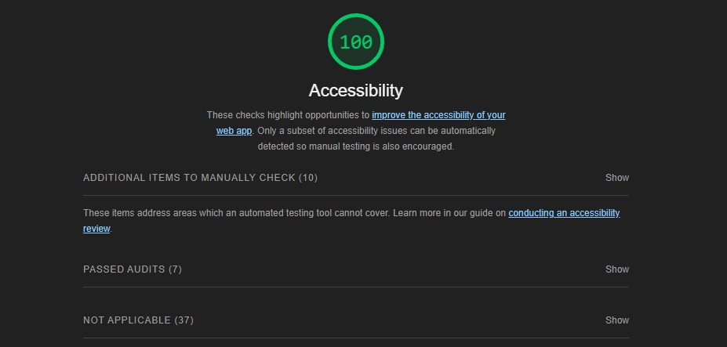

### Lab - 02

## Project Name - Guess Your SuperHero
I created a guessing game to test your Superhero trivia. Only a true hero can answer all five questions correctly.  Do you have what it takes?

## About Me

Experienced Army Veteran and Creator with a background in office administration, graphic design, film, and writing.

## Author:  Darshon Crudup

## Links and Resources

- [guessing game](/index.html);

## Lighthouse Accessibility Report Scrore

## Reflections and Comments

- Know the differences between back ticks ` and single quotes '.
- Define || and ===

## Questions

1. How did this go, overall?

2. What observations or questions do you have about what you’ve learned so far?

3. How long did it take you to complete this assignment? And, before you started, how long did you think it would take you to complete this assignment?
